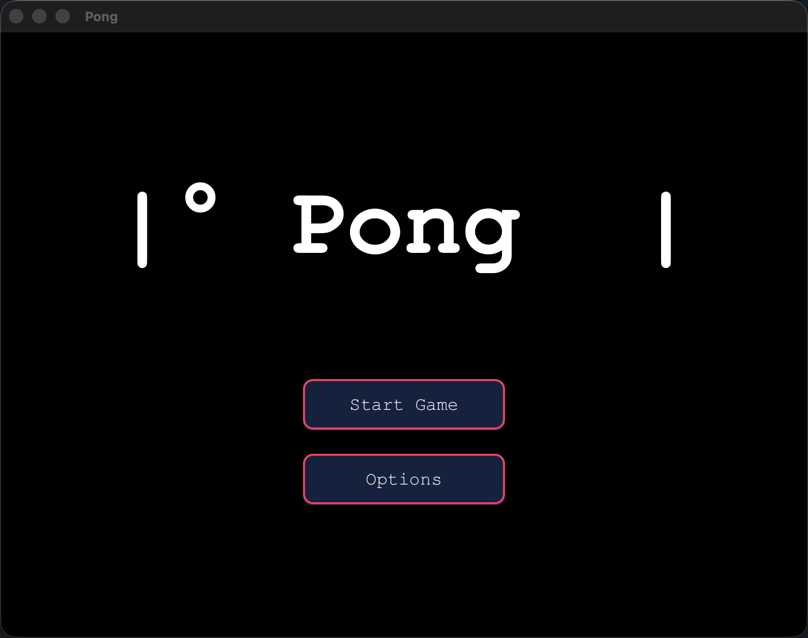
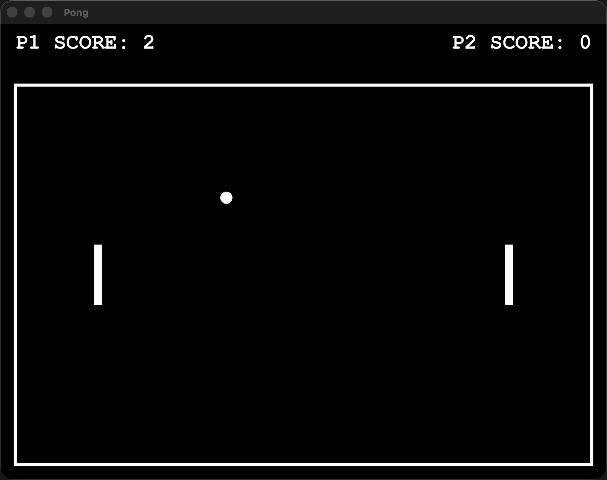
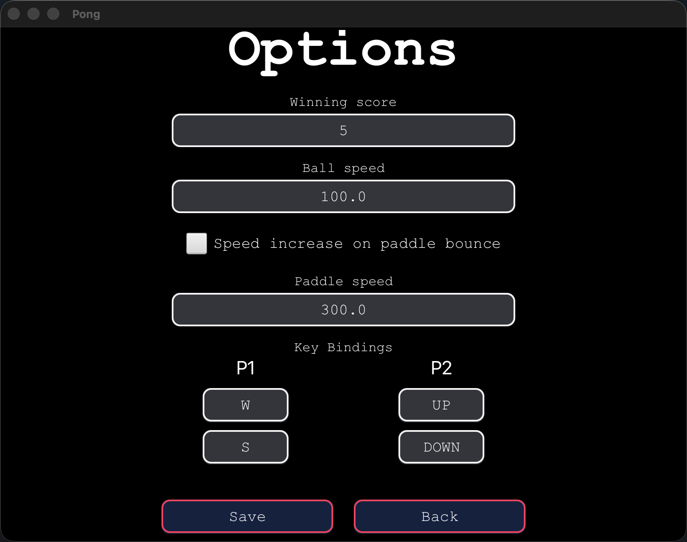

# Pong

A local two-player Pong game built with JavaFX. Pong keeps the classic black-and-white arena, adds configurable match settings and controls, and separates the game loop, physics, rendering, navigation, and persistence into testable components.



## Features

- Local two-player matches with keyboard controls
- Configurable winning score, ball speed, paddle speed, and ball acceleration
- Rebindable controls for both players
- Pause, resume, quit, rematch, and winner states
- Randomized opening ball direction for each round
- Persistent user settings stored outside the repository
- Unit and JavaFX UI tests

## Screenshots

| Gameplay | Options |
| --- | --- |
|  |  |

## Requirements

- JDK 25
- A desktop environment capable of running JavaFX

Gradle does not need to be installed globally; the repository includes the Gradle wrapper. The first build needs an internet connection to download Gradle and project dependencies.

## Run the game

#### Download

Go to the Release tab and download the application for your operating system.

#### Cloning

Clone the repository and launch it with the wrapper:

On Linux and MacOS:

```bash
git clone https://github.com/cuseto/SDMPong.git
cd SDMPong
./gradlew run
```

On Windows:

```powershell
\.gradlew.bat run
```

## Controls

| Action | Player 1 | Player 2 |
| --- | --- | --- |
| Move up | `W` | `Up Arrow` |
| Move down | `S` | `Down Arrow` |

Press `Esc` during a match to pause or resume. After a player wins, press `Enter` to start a new match or `Esc` to return to the main menu.

The movement keys can be changed from **Options**: select a binding, press the replacement key, and save.

## Configuration

The bundled defaults are defined in [`app/src/main/resources/config.yaml`](app/src/main/resources/config.yaml). Changes saved from the Options screen are written to:

```text
~/.sdm-pong/config.yaml
```

The user configuration is loaded on startup and whenever the app returns to the main menu. If it is missing or invalid, the bundled defaults are used.

Default match settings:

| Setting | Value |
| --- | ---: |
| Window size | 1024 × 768 |
| Winning score | 5 |
| Initial ball speed | 100 |
| Paddle speed | 300 |
| Speed increase on bounce | Enabled |

## Test and build

Run the complete test suite:

```bash
./gradlew test
```

Create the application distribution archives:

```bash
./gradlew distZip distTar
```

The generated archives are placed in `app/build/distributions/`.

## Project structure

```text
app/src/main/java/com/cuseto/pong/
├── config/       YAML loading, validation, and persistence
├── game/         Models, input, physics, updates, session, and game loop
├── navigation/   Screen navigation and gameplay lifecycle
├── options/      Options-screen controller
└── view/         JavaFX scenes, canvas rendering, and UI components
```

The project follows a controller-driven design: immutable configuration creates a `GameSession`, ordered updater components advance its state, and JavaFX renderers display each frame. Navigation owns scene changes and stops the active loop when gameplay ends.

## License

This project is licensed under the [GNU General Public License v3.0](LICENSE).
